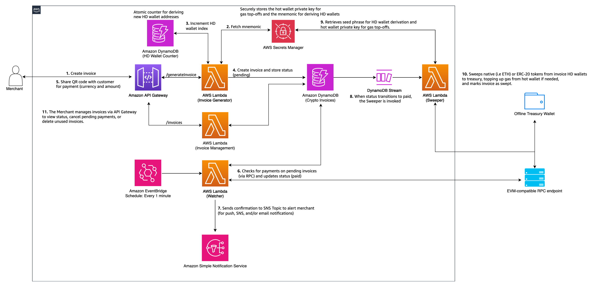

# Processing Digital Asset Payments on AWS

**Authored by: Simon Goldberg and David Dornseifer**

This solution supports native (i.e ETH) and ERC20 token payments on _any_
EVM-compatible blockchain with automated payment detection and fund sweeping
capabilities.

## Table of Contents

- [Architecture](#architecture)
- [Deployment](#deployment)
  - [Prerequisites](#prerequisites)
  - [Quick Start](#quick-start----automated-installation)
  - [Manual Installation](#manual-installation)
- [Using the Payment System](#using-the-payment-system)
- [API Reference](#api-reference)
- [Development and Testing](#development-and-testing)
- [Clean Up](#clean-up-instructions)
- [Troubleshooting](#troubleshooting)

## Architecture



### Payment Flow Overview

The numbers of each of the steps in the payment flow correspond with the numbers
in the architecture diagram above.

1. **Invoice Creation**

- Merchant creates an invoice via the `/create-invoice` REST API (Amazon API
  Gateway).

2-3. **Invoice Generation**

- The Invoice Generator Lambda is triggered, retrieves the mnemonic from AWS
  Secrets Manager, and increments an atomic counter in DynamoDB to
  deterministically derive a new HD wallet address.

4. **Invoice Storage**

- The Lambda creates a new invoice with `paymentstatus: pending` and stores it
  in DynamoDB.

5. **QR Code Delivery**

- A QR code containing the target address, currency, and amount is generated and
  returned to the merchant for sharing with the customer.

6. **Payment Monitoring**

- A watcher Lambda, triggered every minute via EventBridge, fetches all pending
  invoices and checks for payments via the RPC endpoint. Paid invoices are
  updated accordingly.

7. **Payment Confirmation**

- The watcher Lambda can send payment confirmations via Amazon SNS, which can
  trigger email notifications or push updates.

8. **Sweeper Trigger**

- When a payment is detected, a DynamoDB Stream event triggers the Sweeper
  Lambda process.

9-10. **Sweeping Funds**

- The Sweeper calculates required gas and sends additional native gas tokens to
  an invoice's address if necessary (ie for ERC20 invoices). Once sufficient gas
  is available to make a transaction, funds are "swept" to the offline treasury
  wallet. The invoice is then marked as swept.

11. **Invoice Management**

- Merchants can manage invoices (view status, update payments) via REST
  endpoints exposed by API Gateway.

### Technical Payment Flow


## Deployment

### Prerequisites

To deploy this solution, complete the following prerequisite steps to set up your environment:

1. AWS Account and configured AWS CLI. For instructions, refer to [Installing or updating to the latest version of the AWS CLI](https://docs.aws.amazon.com/cli/latest/userguide/getting-started-install.html) and [Getting started with the AWS CDK](https://docs.aws.amazon.com/cdk/v2/guide/getting_started.html).
2. Node.js 18.x or later.
3. AWS CDK CLI installed (npm install -g aws-cdk)
4. Ethereum or EVM-compatible node access (Infura or similar)

### Clone the Repository and Install Dependencies

Run the following commands to clone the GitHub repo and install dependencies:

```bash
git clone git@github.com:aws-samples/sample-serverless-digital-asset-payments.git && cd sample-serverless-digital-asset-payments
npm install
```

### Configure Environment Variables

For straightforward deployment and to support the development or extension of this payment solution, parameters are sourced from an `.env` file during deployment.

**Security Warning:** Private key management is a complex and critical aspect of secure system design. For production environments, private keys and other sensitive credentials should never be stored in plaintext files or embedded in source code. Instead, always use dedicated secret management solutions such as Secrets Manager, AWS KMS, or AWS Nitro Enclaves to securely derive, store, and handle sensitive information. Improper handling of private keys can lead to serious security vulnerabilities and potential data breaches.

Copy the sample configuration:

```bash
cp .env-sample .env
```

Update the `.env` file with the following values:

- `RPC_URL`: The HTTPS RPC URL for your blockchain network (for example, Ethereum)
- `TREASURY_PUBLIC_ADDRESS`: The cold storage wallet address where collected funds will be automatically transferred (swept). This should be a secure wallet, such as a hardware wallet (e.g., Ledger, Trezor), to ensure maximum security for your accumulated funds.
- `HOT_WALLET_PK`: A funded wallet used to cover gas payments for sweeping operations. The key must be provided as a 64-character representation, for example as exported from a development or test MetaMask wallet. Make sure this wallet holds enough native tokens (ETH) to cover transaction fees. You can obtain testnet ether from a faucet.
- `PAYER_PRIVATE_KEY`: Test payer private key (optional variable for execute_payment script)

### Quick Start -- Automated Installation

For complete automated setup:

```bash
# 1. Make sure you have copied and configured your .env file 

# 2. Run the complete setup
npm run setup
```

This script handles all installation, deployment, and configuration steps automatically.

### Manual Installation

If you prefer to set up manually:

1. **Install dependencies:**

```bash
npm install
```

2. **Deploy the CDK stack:**

```bash
cdk deploy
```

3. **Generate and store secrets:**

```bash
npm run setup-secrets
```

The script will securely store the following:

- The generated seed phrase (for deterministic address generation)
- The hot wallet private key you defined in your .env file

Both values are encrypted and stored in Secrets Manager. Consider more advanced solutions such as AWS KMS or Nitro Enclaves based wallet solutions for production workloads.

4. **Set up payment notifications (Optional):**

To receive email alerts when payments are detected or errors with sweeping occur, complete the following steps:

- Navigate to AWS Console → SNS topic created by the stack
- Click "Create subscription" → Select "Email" protocol
- Enter your email address and confirm subscription
- Open your inbox and choose the confirmation link to activate the subscription

Optionally, you can integrate Slack, Lambda consumers, or webhooks as needed.

## Using the Payment System

### Create a Test Invoice and Send a Payment

Now that the crypto invoice system is deployed, you can test it by creating an invoice and making a payment.

First, retrieve the API Gateway URL and API key from the deployed stack and expose these values as environment variables:

```bash
export STACK_NAME="CryptoInvoiceStack"  

export API_URL=$(aws cloudformation describe-stacks --stack-name "$STACK_NAME" \
  --query "Stacks[0].Outputs[?OutputKey=='InvoiceApiBaseUrl'].OutputValue" --output text)
  
export API_KEY_ID=$(aws cloudformation describe-stacks --stack-name "$STACK_NAME" \
  --query "Stacks[0].Outputs[?OutputKey=='InvoiceApiKeyId'].OutputValue" --output text)
  
export API_KEY=$(aws apigateway get-api-key --api-key "$API_KEY_ID" --include-value \
  --query 'value' --output text 2>/dev/null)
  
echo "API URL: $API_URL"
```

Make a request to your API Gateway endpoint and create a sample invoice. For example, the following curl request creates a $5 USDC invoice on Ethereum's Sepolia testnet:

```bash
curl -X POST "${API_URL}generateInvoice" \
  -H "Content-Type: application/json" \
  -H "X-API-Key: $API_KEY" \
  -d '{
    "currency": "ERC20",
    "tokenAddress": "0x1c7D4B196Cb0C7B01d743Fbc6116a902379C7238",
    "tokenSymbol": "USDC",
    "amount": "5.00",
    "decimals": 6
  }'
```

You will receive a unique deposit address and a representation of a QR code in the response:

```json
{
  "invoiceId": "524dd9e8-82c3-4f70-8540-74c693111dbe",
  "address": "0x...",
  "index": "number",
  "qrcodeBase64": "string"
}
```

The QR code is returned as a Base64-encoded Data URL, which can be directly embedded in HTML. This format allows you to use it as the src attribute of an `` tag without additional processing. You can also enter the qrcodeBase64 value into your web browser's address bar to display the image.

The following code shows an example of how to extract the QR code from the invoice generator's response and save it in an HTML file:

```bash
RESPONSE='{ ... your JSON Invoice response here ... }'

echo "$RESPONSE" | jq -r '.qrcodeBase64' | awk '{ print "" }' > qrcode.html
```

Open `qrcode.html` in your browser to view the QR code.

### Send Testnet USDC

Send testnet USDC to the invoice's address to trigger the payment flow. You can obtain testnet USDC for Ethereum Sepolia through Circle's Testnet Faucet.

### Request a Specific Invoice

To request a specific invoice, replace the {invoiceID} placeholder with the invoiceId value received earlier:

```bash
curl -X GET "${API_URL}invoices/{invoiceId}" \
  -H "X-API-Key: $API_KEY"
```

You will receive a result similar to the following:

```json
{
  "currency": "ETH",
  "tokenAddress": null,
  "path": "m/44'/60'/0'/0/8",
  "sweptAt": "2025-07-07T15:50:40.245Z",
  "status": "swept",
  "tokenSymbol": "ETH",
  "amount": "0.00001",
  "createdAt": "2025-07-07T15:49:41.981Z",
  "address": "0xF67e4b8078d837822b8E602F12af76B228a0c1f5",
  "invoiceId": "ed4880c6-ae2f-4400-ac45-9c263e109caf",
  "paidAt": "2025-07-07T15:50:07.551Z"
}
```

The status field of an invoice will change throughout the transaction lifecycle:
- `pending`: Invoice created, awaiting payment
- `paid`: Payment detected and confirmed
- `swept`: Funds successfully transferred to treasury wallet

After it's marked as swept, you can verify that the balance of the paid invoice appears in the cold wallet balance to confirm the successful transfer of funds.

## API Reference

### Generate Invoice Endpoint

**POST** `/generateInvoice`

**Headers:**

- Content-Type: application/json
- X-API-Key: `<your-api-key>` (Get your API Key from AWS Console → API Gateway →
  API Keys)

**Request Body Parameters:**

- `currency` (required): "ETH" or "ERC20"
- `amount` (required): Payment amount as string
- `tokenAddress` (required for ERC20): Contract address
- `tokenSymbol` (required for ERC20): Token symbol
- `decimals` (required for ERC20): Token decimals

**Retrieving API Endpoint and Key:**

Use the environment variables set up in the usage section above (`$API_URL` and `$API_KEY`).

**Example Requests:**

1. ERC20 Token Invoice (Sepolia Testnet):

```bash
curl -X POST "${API_URL}generateInvoice" \
  -H "Content-Type: application/json" \
  -H "X-API-Key: $API_KEY" \
  -d '{
    "currency": "ERC20",
    "tokenAddress": "0x1c7D4B196Cb0C7B01d743Fbc6116a902379C7238",
    "tokenSymbol": "USDC",
    "amount": "5.00",
    "decimals": 6
  }'
```

2. Native ETH Invoice:

```bash
curl -X POST "${API_URL}generateInvoice" \
  -H "Content-Type: application/json" \
  -H "X-API-Key: $API_KEY" \
  -d '{
    "currency": "ETH",
    "amount": "0.01"
  }'
```

**Response:**

```json
{
  "invoiceId": "uuid",
  "address": "0x...",
  "index": "number",
  "qrcodeBase64": "string"
}
```

After creating an invoice, payment must be sent to the designated invoice address to initiate the payment process.

**Security Note:** For production environments, do not accept `tokenAddress` and
`decimals` directly from the client-side. Maintain a pre-approved list of tokens
on the server/admin side to prevent security risks from spoofed contract
addresses.

### Invoice Management API

Additional endpoints for invoice administration:

- **GET** `/invoices` - Get all invoices (with optional status filtering and
  pagination)
- **GET** `/invoices/{invoiceId}` - Get specific invoice details
- **PUT** `/invoices/{invoiceId}` - Update invoice status (limited to
  security-safe operations)
- **DELETE** `/invoices/{invoiceId}` - Delete pending invoices

**Query Parameters for GET /invoices:**

- `status` (optional): Filter by invoice status (`pending`, `paid`, `swept`,
  `cancelled`)
- `limit` (optional): Number of invoices to return (default: 50, max: 100)
- `lastKey` (optional): Pagination key for retrieving next page

**Status Update Rules:**

- `pending` ↔ `cancelled` (bidirectional for unpaid invoices)
- `paid` and `swept` statuses are **immutable** to prevent payment manipulation

**Example Requests:**

```bash
# Get all pending invoices
curl -X GET "${API_URL}invoices?status=pending" \
  -H "X-API-Key: $API_KEY"

# Cancel a pending invoice
curl -X PUT "${API_URL}invoices/{invoiceId}" \
  -H "Content-Type: application/json" \
  -H "X-API-Key: $API_KEY" \
  -d '{"status": "cancelled"}'

# Delete a pending invoice
curl -X DELETE "${API_URL}invoices/{invoiceId}" \
  -H "X-API-Key: $API_KEY"
```

## Development and Testing

**Prerequisites for testing:**

- Deployed CDK stack
- Test wallet with testnet funds
- `jq`, `bc`,`curl` and `eth-cli` installed

### Integration Test Features

1. **`npm run setup`**: Complete deployment with prerequisite checks
2. **`npm run test-invoice-management`**: API endpoint testing
3. **`npm run execute-payment`**: End-to-end payment execution with gas
   optimization

## Clean Up Instructions

To avoid incurring unnecessary charges:

1. **Delete the CDK stack:**

```bash
cdk destroy
```

2. **Clean up local files:**

```bash
rm -rf node_modules/ cdk.out/
```

## Troubleshooting

### Common Issues

1. **Invoice Generation Fails:**
   - Verify seed phrase is stored in Secrets Manager (`npm run setup-secrets`)
   - Check RPC_URL configuration
   - Review Lambda function logs in CloudWatch

2. **Payments Not Detected:**
   - Ensure Watcher function is running (CloudWatch Events)
   - Verify RPC node connectivity
   - Wait 1-2 minutes for detection cycle

3. **Sweeping Issues:**
   - Check hot wallet has sufficient ETH for gas
   - Verify treasury address configuration
   - Monitor Sweeper function logs
   - If there is an error and an invoice gets stuck in the "paid" state,
     navigate to the CryptoInvoices DynamoDB Table in the AWS Console and change
     the status of the invoice back to "pending". Then, change it back to
     "paid". This state transition will reinvoke the Sweeper function.

4. **API Authentication:**
   - Retrieve API key from AWS Console → API Gateway → API Keys
   - Or use AWS CLI:
     `aws apigateway get-api-key --api-key <api-key-id> --include-value`

5. **Testing Issues:**
   - Ensure test wallet has sufficient testnet funds
   - Verify all required tools are installed (`jq`, `bc`, `curl`)
   - Check environment variables are properly configured

## Security

See [CONTRIBUTING](CONTRIBUTING.md#security-issue-notifications) for more
information.

## License

This library is licensed under the MIT-0 License. See the LICENSE file.
